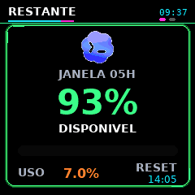
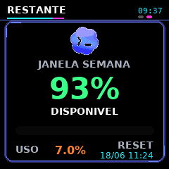

# GeekMagic SmallTV Ultra Codex

Animated 240x240 dashboard for GeekMagic SmallTV devices, focused on Codex usage visibility.

It renders a compact GIF with quota windows, token usage, model breakdowns, and reset times, then uploads it directly to the SmallTV album path:

```text
/image/dashboard.gif
```

The device is then switched to theme `3`, so the generated dashboard becomes the active screen.

## Live preview


## What it shows

| Screen | Purpose | Data source |
| --- | --- | --- |
| `5h window` | Remaining Codex usage in the rolling 5-hour window | Fresh `/status` snapshot when available |
| `Weekly window` | Remaining weekly quota and reset time | Fresh `/status` snapshot when available |
| `Today` | Tokens and calls used today | Local Codex SQLite logs |
| `Breakdown` | Input, cached, output, and reasoning token mix | Local Codex SQLite logs |
| `7-day history` | Rolling usage sparkline | Local Codex SQLite logs |
| `Models` | Token totals grouped by model | Local Codex SQLite logs |

## Static screen gallery

| 5h window | Weekly window |
| --- | --- |
|  |  |

## Screen examples

### Quota window

```text
CODEx

JANELA 05H
81% DISPONIVEL

renova 14:42
```

### Today

```text
HOJE

31.7K tokens
2 chamadas

input / cache / output / reason
```

### Week

```text
7 DIAS

2.16M tokens
sparkline diario

media por chamada
```

### Models

```text
MODELOS

gpt-5-codex     2.99M
latest          11/06 12:55
```

## How it works

The container continuously renders a GIF and optionally uploads it to the device.

```text
Codex logs + sessions + /status snapshot
              |
              v
      smalltv-dashboard container
              |
              v
       out/dashboard.gif
              |
              v
     GeekMagic SmallTV /image/
```

The preferred quota source is the host-side `/status` snapshot:

```text
~/.codex/codex-status.json
```

If that file is missing or stale, the dashboard falls back to local Codex session JSONL events and SQLite usage logs.

## Requirements

- Docker and Docker Compose
- Access to local Codex data under `~/.codex`
- Network access from the container host to the SmallTV device IP
- `systemd --user` if you want automatic `/status` refresh

## Quick start

Copy the environment template:

```bash
cp .env.example .env
```

Edit `.env` and set at least:

```env
SMALLTV_HOST=192.168.3.68
CODEX_HOST_LOG_PATH=/home/casaos/.codex/logs_2.sqlite
CODEX_HOST_LOG_WAL_PATH=/home/casaos/.codex/logs_2.sqlite-wal
CODEX_HOST_LOG_SHM_PATH=/home/casaos/.codex/logs_2.sqlite-shm
CODEX_HOST_SESSIONS_PATH=/home/casaos/.codex/sessions
```

Start the dashboard:

```bash
docker compose up -d --build
```

The generated GIF is written locally to:

```text
out/dashboard.gif
```

## Runtime configuration

### Container variables

| Variable | Default | Description |
| --- | --- | --- |
| `SMALLTV_HOST` | required | SmallTV device IP address |
| `CODEX_LOG_PATH` | `/var/lib/codex/logs_2.sqlite` | Codex SQLite log path inside the container |
| `CODEX_SESSIONS_PATH` | `/var/lib/codex/sessions` | Codex sessions path inside the container |
| `CODEX_STATUS_PATH` | `/var/lib/codex/codex-status.json` | Mounted `/status` snapshot path |
| `CODEX_STATUS_MAX_AGE_SECONDS` | `420` | Max age before `/status` is considered stale |
| `CODEX_LOOKBACK_DAYS` | `7` | Rolling history window |
| `DISPLAY_TZ` | `America/Sao_Paulo` | Timezone used for display labels |
| `REFRESH_SECONDS` | `30` | Render/upload interval |
| `FRAME_MS` | `700` | GIF frame duration |
| `FRAMES_PER_PAGE` | `8` | Animation frames per dashboard page |
| `MAX_GIF_BYTES` | `450000` | Payload size limit for SmallTV upload |
| `UPLOAD_ENABLED` | `true` | Set to `false` to render locally only |
| `RUN_ONCE` | `false` | Set to `true` for one-shot rendering |
| `GIF_FILENAME` | `dashboard.gif` | File name used on the SmallTV device |
| `OUTPUT_PATH` | `/var/cache/smalltv-dashboard/dashboard.gif` | GIF path inside the container |

### Host mount variables

| Variable | Description |
| --- | --- |
| `CODEX_HOST_LOG_PATH` | Host path to `logs_2.sqlite` |
| `CODEX_HOST_LOG_WAL_PATH` | Host path to `logs_2.sqlite-wal` |
| `CODEX_HOST_LOG_SHM_PATH` | Host path to `logs_2.sqlite-shm` |
| `CODEX_HOST_SESSIONS_PATH` | Host path to the Codex `sessions` directory |
| `CODEX_HOST_STATUS_PATH` | Optional host path to `codex-status.json`; defaults to `${HOME}/.codex/codex-status.json` |

### Build-time variable

| Variable | Default | Description |
| --- | --- | --- |
| `CODEX_ICON_URL` | `https://persistent.oaistatic.com/codex/icon-gif.mp4` | Source video used to generate Codex icon frames |

## Refreshing quota state with `/status`

For live quota percentages, install the user-level timer that periodically opens Codex, runs `/status`, parses the output, and writes:

```text
~/.codex/codex-status.json
```

Install:

```bash
mkdir -p ~/.config/systemd/user
mkdir -p ~/.config/smalltv-dashboard
cp systemd/codex-status-refresh.env.example ~/.config/smalltv-dashboard/codex-status-refresh.env
cp systemd/codex-status-refresh.service ~/.config/systemd/user/
cp systemd/codex-status-refresh.timer ~/.config/systemd/user/
systemctl --user daemon-reload
systemctl --user enable --now codex-status-refresh.timer
```

Keep the user timer alive after logout:

```bash
sudo loginctl enable-linger "$USER"
```

Edit the timer environment file:

```text
~/.config/smalltv-dashboard/codex-status-refresh.env
```

Useful options:

| Variable | Description |
| --- | --- |
| `CODEX_STATUS_CODEX_BIN` | Full path to `codex` when it is not on the default PATH, common with NVM |
| `CODEX_STATUS_TIMEOUT` | Seconds to wait for `/status` output |
| `CODEX_STATUS_ATTEMPTS` | Number of attempts when the Codex TUI does not return `/status` cleanly |
| `CODEX_STATUS_OUTPUT` | Output path for the parsed status JSON |
| `CODEX_STATUS_CWD` | Working directory used when launching Codex |

Check the timer:

```bash
systemctl --user status codex-status-refresh.timer
systemctl --user list-timers --all | grep codex-status-refresh
```

Run one refresh immediately:

```bash
systemctl --user start codex-status-refresh.service
```

## Troubleshooting

### The screen is stale

Check whether the container can reach the device:

```bash
docker logs --tail 80 smalltv-dashboard
```

If you see `No route to host`, confirm the current IP of the GeekMagic SmallTV and update:

```env
SMALLTV_HOST=192.168.x.x
```

### Quota percentages are old

Check the status snapshot timestamp:

```bash
cat ~/.codex/codex-status.json
```

If `updated_at_iso` is old, restart the timer:

```bash
systemctl --user daemon-reload
systemctl --user restart codex-status-refresh.timer
systemctl --user start codex-status-refresh.service
```

### Render only, do not upload

Use local rendering mode:

```env
UPLOAD_ENABLED=false
```

Then restart:

```bash
docker compose up -d --build
```
